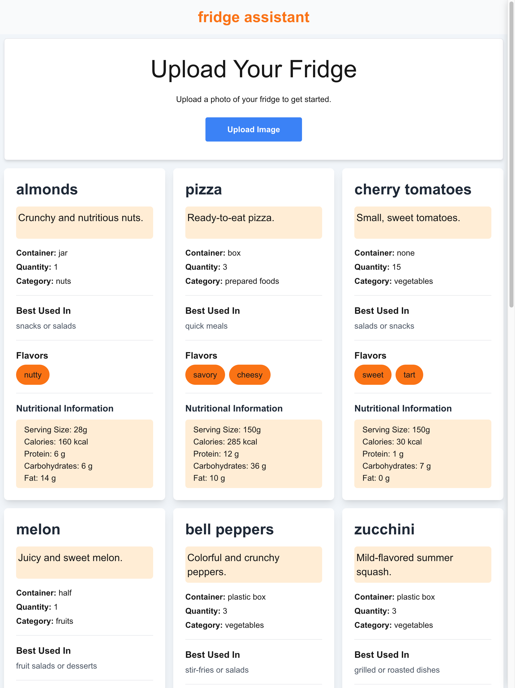

# fridge assistant: What's in your fridge?

### Description

**fridge assistant** helps users identify food items in their fridge and provides information about each item in a friendly easy to read grid. It is both mobile friendly and easy to use on larger screen sizes.

## Features

1. Upload any image with food items and receive a list of the items from the image.


2. Each food item is displayed in an easy to read card with helpful information about each item including, name, description, quantity, flavors and nutritional information.



##

# React Components

### `<ImageUpload />`

The ImageUpload component allows users to upload an image of their fridge's contents. It processes the image and sends it to the backend for analysis. The identified ingredients are then set in the parent component's state.

### Props

- `setIngredients`: A state setter function to update the list of ingredients identified from the uploaded image.

### State

- `file`: Stores the uploaded file.
- `error`: Stores any error messages encountered during the upload process.
- `isLoading`: Indicates whether the image is being processed.

### Refs

- `formRef`: A reference to the form element. Used during the submit phase
- `fileInputRef`: A reference to the file input element.

### Methods

- `handleImageChange(e: ChangeEvent<HTMLInputElement>)`: Handles the change event for the file input, setting the selected file in the state.
- `handleSubmit(e: React.FormEvent<HTMLFormElement>)`: Handles the form submission, reads the file as a base64 string, validates it, and sends it to the backend API for processing.

### Workflow

1. **Image Selection:** Users select an image using the file input.
2. **Image Processing:** The selected image is read as a base64 string and validated.
3. **API Call:** The base64 string is sent to the /api/imageDescription endpoint.
4. **Response Handling:** The response from the API is used to update the list of ingredients or display an error message.

### UI Elements

- A form with a file input for image upload.
- A button to trigger the file input and display a loading spinner during processing.
- Error messages displayed below the button.

### Example Usage

```
<ImageUpload setIngredients={setIngredients} />
```

#

### `<FoodGrid />`

The FoodGrid component is responsible for displaying a grid of food items. Each item is represented by a FoodItemCard component. This component dynamically adjusts the number of columns based on the screen size.

### Props

- `ingredients`: An array of `Ingredient` objects to be displayed in the grid.

### Interface

```
interface FoodGridProps {
  ingredients: Ingredient[];
}
```

### Example Usage

```
 <FoodGrid ingredients={ingredients} />
```

#

### `<FoodItemCard>`

The FoodItemCard component is responsible for displaying detailed information about a single food item. It is used within the FoodGrid component to render each ingredient in a card format.

### Props

- `ingredient`: An object of type Ingredient that contains information about the food item.

### Interface

See the api section for details on the schema

```
interface FoodItemCardProps {
  ingredient: Ingredient;
}
```

### Example Usage

```
<FoodItemCard ingredient={ingredient} />
```

#

## API ROUTE

### POST /imageDescription

`route.ts File`

This file defines the API endpoint for processing image descriptions. It uses OpenAI's GPT-4o model to analyze an uploaded image and return a structured response.

### Imports

- `generateObject` from `ai`: Function to generate an object using the OpenAI model.
- `openAI` from `@/app/providers/openAI`: Function to initialize the OpenAI model.
- `outputSchema` from @/app/schemas/schemas: Schema for validating the output.
- `prompt` from @/app/constants/constants: Prompt text for the OpenAI model.

### Endpoint

- `POST /imageDescription`: This is a `Nextjs` App Router endpoint.
- `Input`: request object with a Base64 image file string and a image mime-type which are passed to the openAI `generateObject` function.

## About generateObject

In order to get a consistent response from the LLM, we need to ask it to provide a response in a structured format. That's where the `generateObject` function can help our app.

The `generateObject` function takes the following arguments:

- model: the openai model we want to use
- output: <object> - return an object as output
- schema: a schema validated with the `zod` dependency
- maxTokens: this endpoint uses a large number of tokens in order to process the image description result. We are currently capping the number of tokens in order to avoid overuse during the development phase.
- messages: an array of message objects. In this case, we want our application endpoint to send the image and a text prompt with instructions to the model.

### Output

A successful result from the `generateObject` function will return a response which we can cast to JSON and return to our `<ImageUpload />` component.

### Error Handling and Validation

The app validates the image file and protects the endpoint in a try/catch. In the event of API failure on the part of OpenAI, or if we somehow pass in incorrect arguments. The route will catch the error and report back to the caller.

The `<ImageUpload />` component is designed to handle errors gracefully and will display error messages in red font color directly underneath the `Upload` button.

## Lessons Learn and Some Limitations

There are probably better models to use for this. In early testing, Clause-Sonnet seemed to provide more consistent results. I choose to go with OpenAI `gpt-4o` in order to streamline the development process. The documentation is good and OpenAI provides a way to get a consistent structured response.

In a real-world scenario, a few ways the application could be optimized would be to do benchmark testing of various models to find a model that is best suited for this purpose. Additionally, asking the model to report back concrete data such as nutritional information seems like a task that could be handed off to a custom dataset that could be built up over time. This might save tokens and improve the latency of the task.
